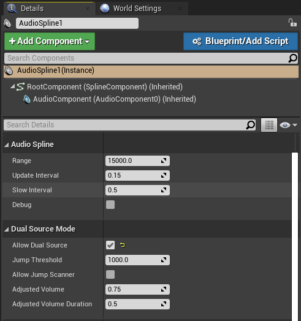

# AudioSpline
Audio Spline made in Unreal Engine 4.26. 

## Description
This type of actor was created mainly to cover long/large areas with a movable sound. For example you can use it to apply sounds to: river flowing by, wind on the cliff, distant battle soundscape, etc..

Virtual speaker position is estimated based on the point on the curve that is closest to the listener's position.

## Supported Engine Versions
4.26 

## How to install the Plugin 
After you download the repository, extract the zip archive. Your Project can be either a C++ Project or a Blueprint Project. 

Copy the folders "AudioSplinePlugin" into the "Plugins" folder of your UE4 project. 

If you don’t have a Plugins folder in your project folder yet, just create one.

You will be able to see it in the Editor only if you toggle the "Show Plugin Content" on the "View Options".

## How to use the Plugin
There are two ways of using this tool. You can simply use the C++ Actor or you can create a Blueprint class out of it.

### Using the C++ Actor
Drag the AudioSpline Actor into the world and add as many spline points as you need.
To add a spline point drag one of the X,Y,Z arrows while holding alt key on your keyboard. Alternatevely you can add a spline point anywhere on the spline by right click on it. 

Set your Sound Cue in the Details panel.   

You are ready to go!

### Using a Blueprint Class
This will allow you to add your unique blueprint logic to the Audio Spline.

Right click on the C++ Actor and select "Create Blueprint Class based on Audio Spline". 

Choose a name and a directory for your Blueprint class.

Set your Sound Cue in the Details panel. Then click Compile and Save.

Drag the BP_AudioSpline Actor into the world and add as many spline points as you need. To add a spline point drag one of the X,Y,Z arrows while holding alt key on your keyboard. Alternatevely you can add a spline point anywhere on the spline by right click on it.

### Modifying the parameters
Once you have created the instance of the object in the world, you will be able to see the exposed variables on the "Details" panel (you have to scroll down a bit).

#### Range: 

The sound is stopped If the distance between the Player and the Audio Component is greater than the Range. Otherwise the sound fades-in.
Furthermore, the range is used to slow down the tick in order to optimise the performance.

#### Update Interval:

User-defined tick interval.

#### Slow Interval:

Tick interval when the player is not in range. This value should be greater than UpdateInterval.

If you don't want to optimise the tick, set the Slow Interval to be equal to the Update Interval.

#### Debug:

Draw a sphere around the active audio sources. There will be an inner sphere to quickly visualise the sound and an outer sphere that represents the Range described above.

#### Allow Dual Source:

If true, it enables the Dual Source Mode. 

The DualSource spawns a new Audio Source if the closest location on the spline jumps above a threshold.

Do not update this bool during PIE(Play In Editor)

#### Jump Threshold

Play the Audio Source If the difference between the old and the current source position is greater than JumpThreshold. Use the Jump Scanner to find a value that suits your needs. If a Jump is detected it will be printed out into the Output Log.

#### Jump Scanner

Debug utility. Print to the Output Log the biggest jump detected during PIE (Play In Editor). It will help you decide which value to put onto the Jump Threshold. 

#### Adjusted Volume

Volume of BOTH Audio Components when the Dual Source is spawned. 

#### Adjusted Volume Duration

How quick the Main Audio Component is going to fade/adjust its volume when Dual Audio Component spawns OR get killed.

## How to contact me
For any feedback please send me an email: 
luigiplatania94@gmail.com

My website: https://www.luigiplatania.net/
