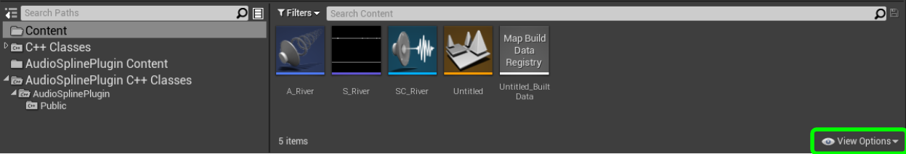

# AudioSpline
Audio Spline made in Unreal Engine 4.26. 

### Description
It moves the location of the audio component to the closest point on the spline to the player location.

### How to install the Plugin 
This plugin was made in UE 4.26.
After you download the repository, extract the zip archive. Copy the folders "AudioSplinePlugin" into the "Plugins" folder of your UE4 project. 
If you don’t have a Plugins folder in your project folder yet, just create one.
You will be able to see it in the Editor only if you toggle the "Show Plugin Content" on the "View Options".

### How to use the Plugin
Drag the AudioSpline Actor into the world and add as many spline points as you need.

Set your Sound Cue in the Details panel.   

Alternatevely you can create a blueprint class and do the same step above. This will allow you to add your unique blueprint logic to the Audio Spline

