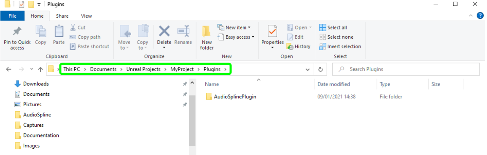
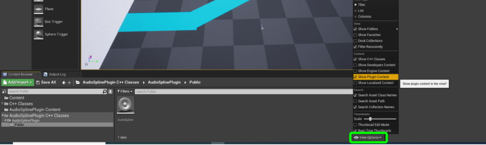
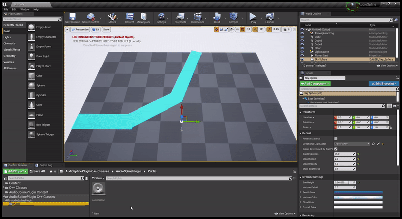
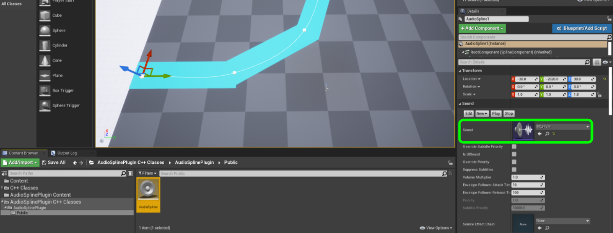
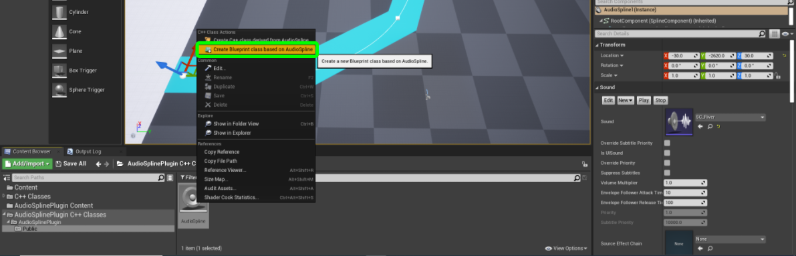
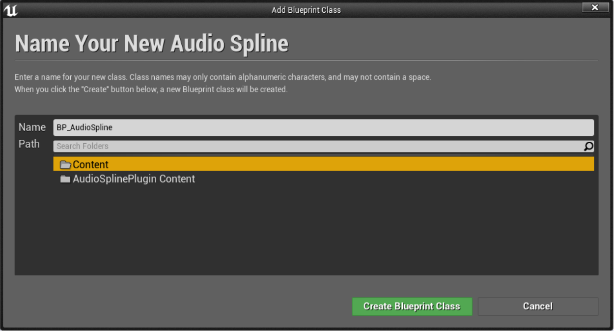
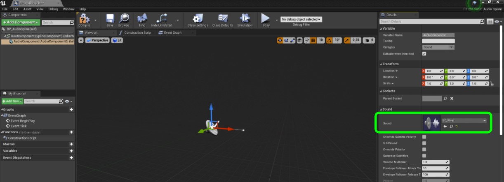
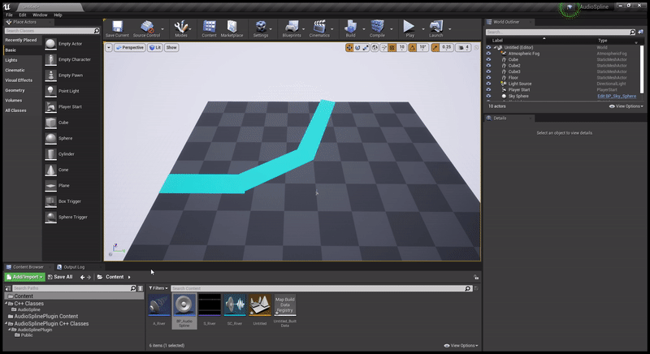
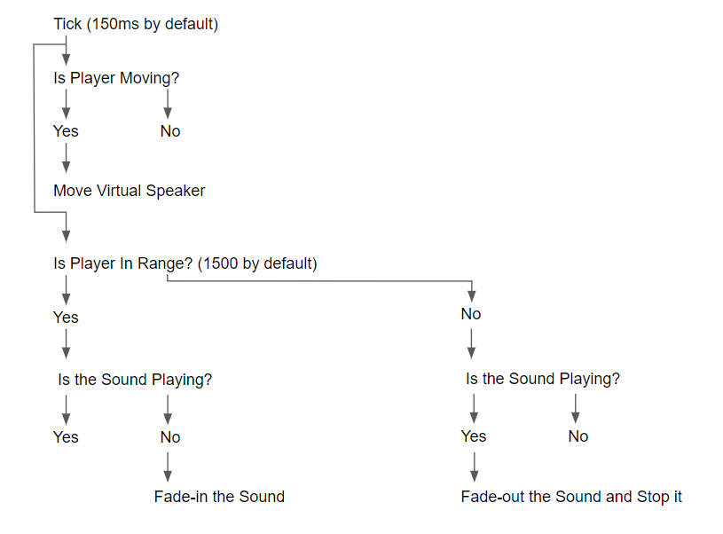
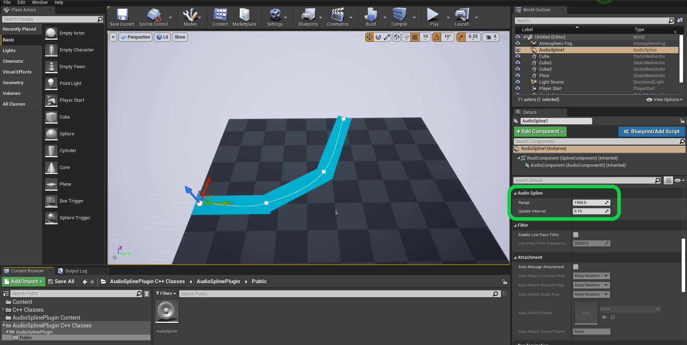

# AudioSpline
Audio Spline made in Unreal Engine 4.26. 

### Description
It moves the location of the audio component to the closest point on the spline to the player location.

### Supported Engine Versions
4.26

### Supported Platforms
Win 32, Win 64, MacOS, Playstation 4 and Xbox one.

### How to install the Plugin 
After you download the repository, extract the zip archive. Your Project can be either a C++ Project or a Blueprint Project. 
Copy the folders "AudioSplinePlugin" into the "Plugins" folder of your UE4 project. 
If you don’t have a Plugins folder in your project folder yet, just create one.

You will be able to see it in the Editor only if you toggle the "Show Plugin Content" on the "View Options".

### How to use the Plugin
There are two ways of using this tool. You can simply use the C++ Actor or you can create a Blueprint class out of it.

#### Using the C++ Actor
Drag the AudioSpline Actor into the world and add as many spline points as you need.
To add a spline point drag one of the X,Y,Z arrows while holding alt key on your keyboard. Alternatevely you can add a spline point anywhere on the spline by right click on it. 

Set your Sound Cue in the Details panel.   

#### Using a Blueprint Class
This will allow you to add your unique blueprint logic to the Audio Spline.
Right click on the C++ Actor and select "Create Blueprint Class based on Audio Spline". 

Choose a name and a directory for your Blueprint class.

Set your Sound Cue in the Details panel. Then click Compile and Save.

Drag the BP_AudioSpline Actor into the world and add as many spline points as you need. To add a spline point drag one of the X,Y,Z arrows while holding alt key on your keyboard. Alternatevely you can add a spline point anywhere on the spline by right click on it.

### How it works

You can change the Update Interval (Tick Interval) and the Range either on each instance of the actor or on the Blueprint class.

### How to contact me
For any feedback please send me an email: 
luigiplatania94@gmail.com

My website: https://www.luigiplatania.net/
